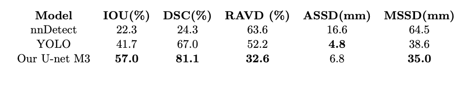

[View Document] [https://github.com/jitendra3010/MRI-Fractures-Project/blob/main/Optimized_U_Net_Architecture_for_Precise_Edema_ROI_Definition_in_MRI_Image_Segmentation.pdf]

# MRI-Based Foot Edema/Fracture Detection

This repository contains the code and resources for a Convolutional Neural Network (CNN)-based system for detecting foot Edema/fractures in MRI scans. The project leverages advanced image segmentation techniques to identify regions of interest, enabling accurate and efficient medical diagnosis.

## Overview

The primary objective of this project is to develop a deep learning model that can accurately segment and detect Edema/fractures in foot MRI scans. Using a U-Net architecture, the model processes grayscale images to generate binary segmentation masks highlighting potential Edema/fractures.

## Features

- **Custom U-Net Architecture**: Incorporates down-sampling and up-sampling blocks with double convolution layers for effective feature extraction and reconstruction.
- **Bilinear Upsampling**: Optional implementation to improve segmentation performance.
- **IoU Evaluation**: Performance is measured using the Intersection over Union (IoU) metric to ensure precise segmentation.
- **PyTorch Implementation**: Built using PyTorch for flexibility and ease of use.

## Dataset

- The dataset comprises slices from foot MRI scans of 96 patients.
- Each image is grayscale and annotated with binary segmentation masks indicating Edema/fractures.

## Model Architecture

- **Input Channels**: 1 (grayscale images)
- **Output Channels**: 1 (binary segmentation mask)
- **Down Block**: Max pooling layer followed by a double convolution block.
- **Up Block**: Upsampling layer followed by a double convolution block, with options for bilinear interpolation or transposed convolution.
- **Final Convolution Layer**: Reduces the number of channels to match the output classes.

## Training Details

- **Optimizer**: Adam optimizer with a learning rate of `0.0001` and weight decay of `1e-4`.
- **Loss Function**: Binary Cross-Entropy with Dice Loss.
- **Validation**: Monitored using IoU scores to detect signs of overfitting.
- **Augmentation**: Includes random rotations, flips, and intensity normalization to enhance generalization.

## Installation

1. Clone this repository:
   ```bash
   git clone https://github.com/your-username/mri-foot-fracture-detection.git
   cd mri-foot-fracture-detection
   ```
2. Create a Python virtual environment and activate it:
   ```bash
   python -m venv venv
   source venv/bin/activate  # On Windows: venv\Scripts\activate
   ```
3. Install the required dependencies:
   ```bash
   pip install -r requirements.txt
   ```

## Usage

1. Prepare the dataset:
   - Organize the dataset into `train`, `validation`, and `test` directories.
   - Update the `config.json` file with the dataset paths.

2. Train the model:
   ```bash
   python train.py --config config.json
   ```

3. Evaluate the model:
   ```bash
   python evaluate.py --model checkpoints/best_model.pth --data data/test
   ```

4. Visualize results:
   ```bash
   python visualize.py --model checkpoints/best_model.pth --image data/test/image_01.png
   ```

## Results

- **IoU Scores**:
 

- Qualitative results demonstrate the model's ability to localize edema with high precision.

## Future Work

- Expand the dataset to include additional patients and modalities.
- Fine-tune hyperparameters to further reduce overfitting.
- Implement a multi-class segmentation approach for detecting different edema/fracture types.

## Contributions

This project was developed as part of research at the CDM CoBaab Lab under the guidance of Professor Jacob Furst. Contributions to the code, dataset preparation, or documentation are welcome.

## License

This project is licensed under the MIT License. See the [LICENSE](LICENSE) file for details.

## Contact

For any inquiries or contributions, please contact Jitendra Kumar Mishra at [jitendra3010@gmail.com](mailto:jitendra3010@gmail.com).

---

**Note**: This repository is intended for academic and research purposes only. For clinical use, consult a certified medical professional.
